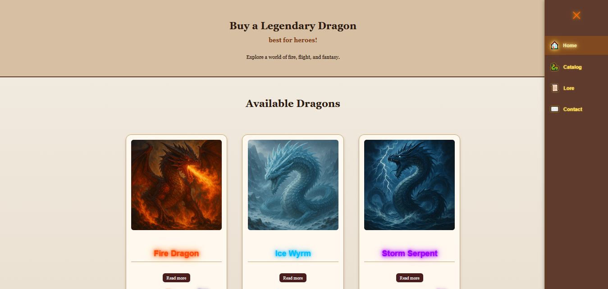

# 🐉 Dragon Shop — Fantasy Dragon Store & Lore

**Dragon Shop** is a small fantasy-themed website where you can explore a world of mythical dragons.  
Browse the catalog, read about dragon lore, and even “purchase” your own magical beast.

## 🔥 Features

- ✨ Home page with animated dragon-themed visuals
- 🐲 Dragon catalog with glowing effects by element (Fire, Ice, Poison, etc.)
- 📖 Lore page that tells the story of the world and dragons
- 📬 Contact page with a working feedback form
- 🛒 “Buy” buttons with custom pop-ups (SweetAlert2)
- 📱 Mobile-responsive layout for phones and tablets
- 🎨 Custom HTML, CSS and JavaScript (no frameworks)

## 🚀 How to Use

Simply open `index.html` in your browser.  
Or visit the deployed site on **GitHub Pages** (see link below once published).

## 📁 Project Structure

dragon-shop/
├── index.html
├── catalog.html
├── contact.html
├── lore.html
├── css/
│ └── style.css
├── js/
│ └── script.js
├── images/
│ └── (dragon images and backgrounds)

## 🛠️ Technologies Used

- HTML5 + CSS3
- Vanilla JavaScript
- SweetAlert2 for modal pop-ups
- Media queries for responsive design

## 👤 Author

**[knopchHQ]** – Beginner front-end developer, passionate about creative and fantasy-themed web projects.  
This project was created as part of my learning journey.

## 🌐 Live Demo

[[https://your-username.github.io/dragon-shop/](https://knopchhq.github.io/Dragon-shop/)]

